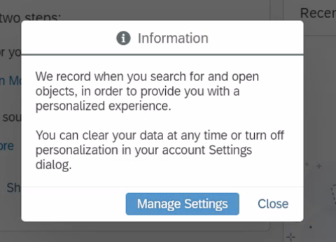
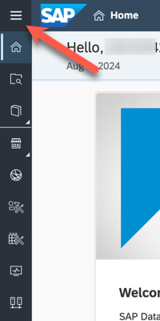
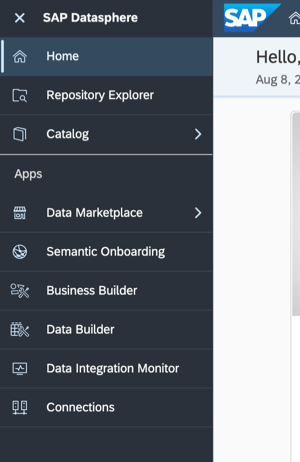
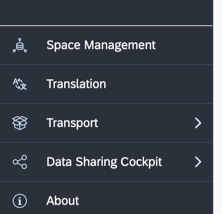
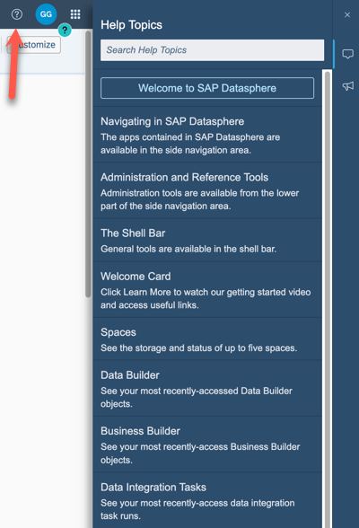

# Your First Log On 

> :memo: **Note:** This is an Optional Exercise

---

1. Open Google Chrome or Microsoft Edge and log on to your SAP Datasphere system.
 

2. In case you get the following pop-up message, use the ***CLOSE*** button to get to the start screen. 
 

3. In the top left of the start screen you will find the menu options.  
 

4. By clicking on the menu in the top left (the hamburger icon), you can expand the menu to also show the menu text.  
 

5. The bottom part of the menu shows the administrative apps.  
 

6. Now let’s explain the different areas:  

| Menu Items:              | Description:                            |
|:-------------------------|:----------------------------------------|
| Repository Explorer      | Browse and create objects in the repository |
| Catalog                  | Discover, enrich, classify, and publish high-quality, trusted data and analytic assets from across your enterprise |
| Data Marketplace         | Purchase and/or access data products from data providers and access them directly in your space (basic trial does not allow data import) |
| Semantic Onboarding        | Import semantically-rich objects from your SAP systems, the Content Network, and the Public Data Marketplace and other marketplace contexts |
| Business Builder         | Create business entities, fact models, and consumption models to present your data to analytics clients |
| Data Builder             | Acquire, prepare, and model data using tables, flows, views, analytic models, data access controls, and other objects |
| Data Integration Monitor | Monitor remote tables, persisted views, flows and task chains |
| Connections              | Create connections to source systems to allow accessing and importing data into SAP Datasphere |

7. Now let’s take a look at the menu items from the administrative section:  

| Menu Items:               | Description:                              |
|:-----------------|:----------------------------------------|
| Space Management | Spaces are a fundamental concept of SAP Datasphere and we will clarify the Space concept later on in this section. |
| Translation | Translate metadata such as business names and column names for dimensions, analytic models and hierarchy dimension labels for SAP Analytics Cloud stories (translation is enabled by space administrator, not configured in basic trial) |
| Transport | Contains tools to create packages and add objects from your space in preparation for the transfer to another tenant as well as exporting and importing content for sharing with other tenants |
| Data Sharing Cockpit         | Become a data provider and make your data products available in Data Marketplace |
| About           | Displays technical information about your version of SAP Datasphere |

As the administrator role is not assigned to your user in the basic trial, you do not have access to the tools ***Security*** (manage users, roles and monitor activities), ***System Monitor*** (monitor the performance of your system and identify storage, task, out-of-memory, and other issues) and ***Configuration*** & ***Administration*** (e.g., manage certificates, audit settings, identity providers and components like Cloud Connector).

8. When you now navigate to the top right corner, please click on the icon to launch the Help dialog. In the Help dialog you have multiple options from some Quick Start help to reach out to our support team.  
 

## Summary

Now that you have learned how to set up your account, let's move forward to get to know your space. 

Continue to - [Exercise 01: Get to know your own Space ](../ex01/README.md)
