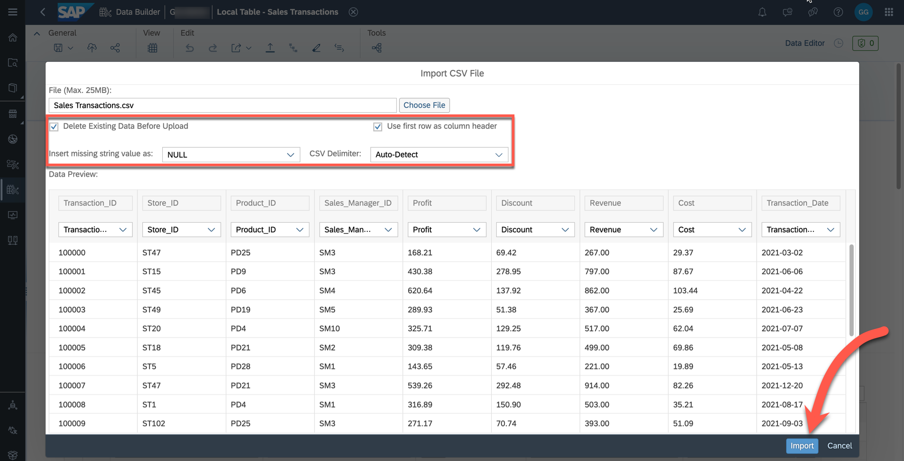
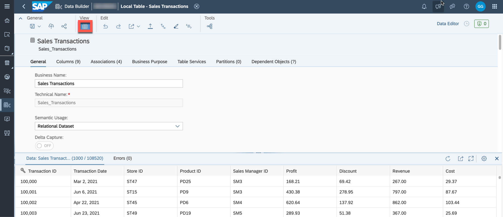

# Exercise 5 - Uploading Data

In this exercise, we will populate the tables created in the previous steps, ensuring we have data for analysis. These exercises use data from CSV files to allow for easy repetition in any SAP Datasphere tenant.

To explore the various connectivity options of SAP Datasphere, refer to [the details available here](https://help.sap.com/docs/SAP_DATASPHERE/9f804b8efa8043539289f42f372c4862/bffbd58c15784a62af0520f171018ded.html) or explore the connections available in the app ***Connections*** (click on the corresponding icon on the left side).

The files for this exercise are part of the ZIP file you downloaded at the beginning. We will now upload the CSV files into the corresponding tables.

2. In your SAP Datasphere tenant select the menu option ***Data Builder*** on the left-hand side and click on your folder `TECHED2024-DA180`.
3. Click on the table ***Sales Transactions***.
4. Select the menu option ***Upload Data from CSV File*** in the toolbar.
  

5. Click ***Choose File***.  
6. Navigate to where you unzipped the download.
7. Select the file `Sales Transactions.csv`.
  

8. Ensure the option ***Delete Existing Data Before Upload*** checkbox is ticked.
9. Ensure the option ***Use first row as column header*** checkbox is ticked.
10. Ensure the option ***Insert missing string value as*** is set to ***NULL***.
11. Ensure the ***CSV Delimiter*** option is set to ***Auto-Detect***.
12. Ensure that all columns of the table have a mapped column from the CSV file.
13. Click ***Import***.
  

14. You should receive a message about the successful import of the information.
15. You can use the ***Data Preview*** to check the data loaded into the table.
 

16. There is no need to save / deploy the table after you imported the data.

17. Continue and repeat the steps 4 - 15 for the other tables. Each table does have a corresponding CSV file as part of the download. Please upload the data for the following tables: - ***Product*** (`Dimension Product.csv`) - ***Store*** (`Dimension Store.csv`)  - ***Sales Manager*** (`Dimension Sales Manager.csv`) 

## Summary

Now you have imported all the data files and you can start to build the data model.

Continue to - [Exercise 06: Creating the Dimension ](../ex06/README.md)
