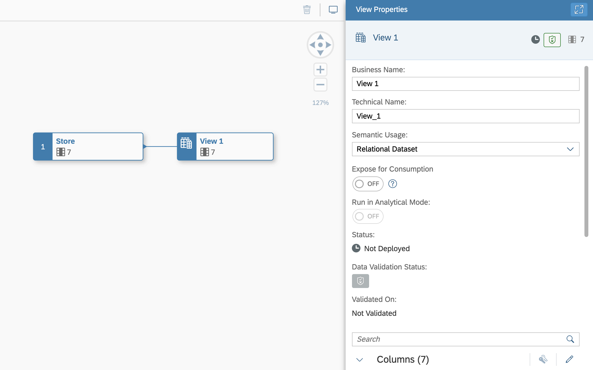
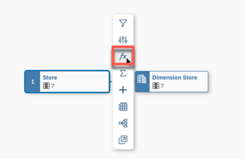
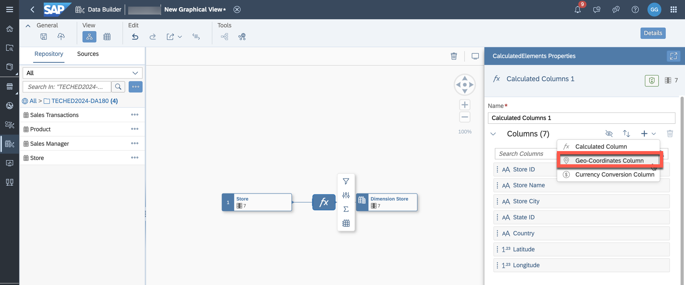
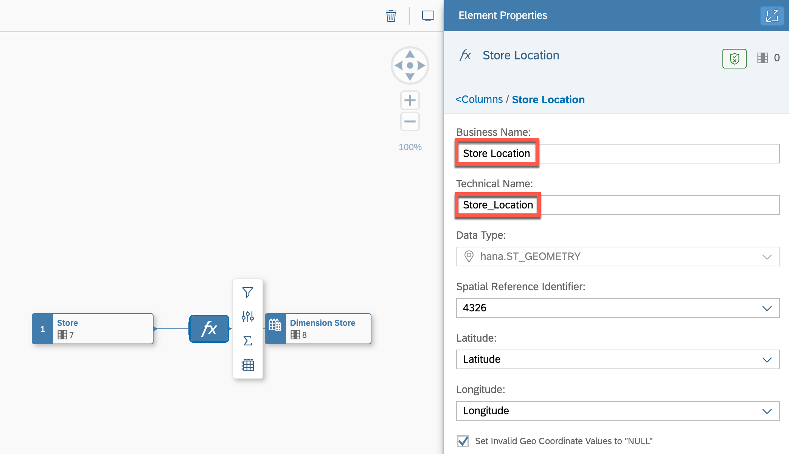
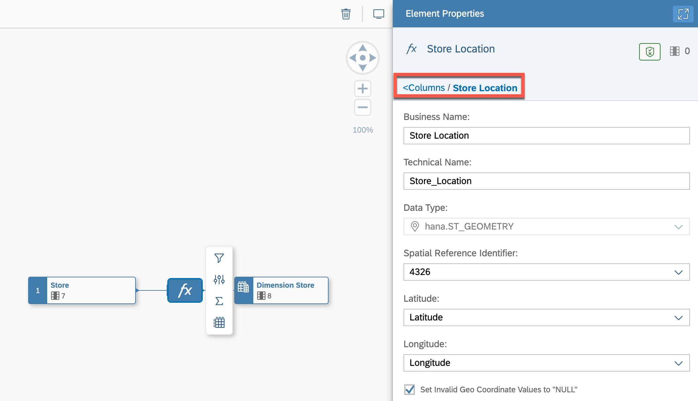
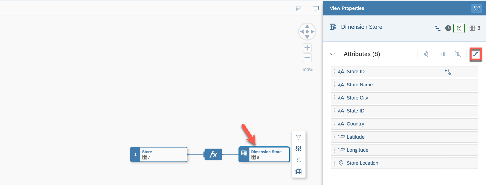

# Exercise 6 - Creating the Dimension 

In this exercise, we will create a new view of the semantic type dimension based on our previously created table. We will enhance this data by configuring a geographic enrichment so that we can visualize the store location on a geo map later in SAP Analytics Cloud.

1. Log On to your SAP Datasphere tenant.

2. Select the menu option ***Data Builder*** on the left-hand side.

3. Click ***New Graphical View***.
  
     

4. On the left-hand side you can decide between:
    * ***Repository***: Here you have access to the local tables (imported data), Views, Intelligent Lookups and Shared Objects.
    * ***Sources***: Here you have access to respective objects from your connections.

5. Ensure you select the option ***Repository*** and open the folder `TECHED2024-DA180`.

6. You are presented with the list of tables, which we created previously. Drag and drop the table ***Store*** to the canvas.
  
     

7. You automatically will – in addition to the table you dragged to the canvas – receive the output view, in the screenshot called `View 1`:

8. Navigate to the ***View Properties*** window by clicking on the `View 1` in the canvas.

     

9. Here you can configure properties for the view:
    * ***Business Name***: Dimension Store
    * ***Technical Name***: Dimension_Store
    * ***Semantic Usage***: Dimension

         
 
10. Now click on the table ***Store*** on the canvas.

     

11. When you select the table on the canvas, you have the following options (top to bottom)
    - You can add filter on top of the source entity.
    - You can rename or hide columns as part of a projection.
    - You can add Calculated Columns.
    - You can add an Aggregation View.
    - You can add additional tables / views based on suggested joins, which are based on your Entity Relationship model.
    - You can preview the data.
    - You can open the Impact & Lineage Analysis.
    - You can open the table in the editor in another browser tab.

12. Use the option to add a new calculated column. This option also includes the ability to configure the geographic enrichment.
     
 
13. Now click on the new node ***fx*** on the canvas.

     

14. Navigate to the properties on the right-hand side.

15. Click on the ***+*** sign and select the option ***Geo-Coordinates Column***.

     
 
16. You are presented with the properties for the new column. Configure the following details:
    - ***Business Name***: Store Location
    - ***Technical Name***: Store_Location
    - ***Latitude***: Latitude
    - ***Longitude***: Longitude

      

17. After you configured the details, click on the ***<Columns*** option in the properties window to go back.
  
     

18. Select the final output node for the graphical view of semantic type dimension.

19. Navigate to the properties on the right-hand side.

20. Navigate to the ***Attributes*** area. 
21. Use the pencil icon (top right area) to open the details for the Attributes.
  
    

22. Ensure that the semantic type for the attribute ***Store Name*** is set to ***Text***.
23. Set the ***Label (Text / Association)*** column for the line item ***Store ID*** to ***Store Name***.
  
     

24. Click ***Close***.
 
25. In the toolbar in the ***General*** menu, use the option to save your view in the folder `TECHED2024-DA180`.

26. After saving your dimension view, ensure you deploy the view.
  
     

## Summary

You've now created your dimension view ***Dimension Store***, including the added geo-coordinates column ***Store Location***, which is required for using visualizations on geo maps within SAP Analytics Cloud.

Continue to - [Exercise 07: Creating the View ](../ex07/README.md)