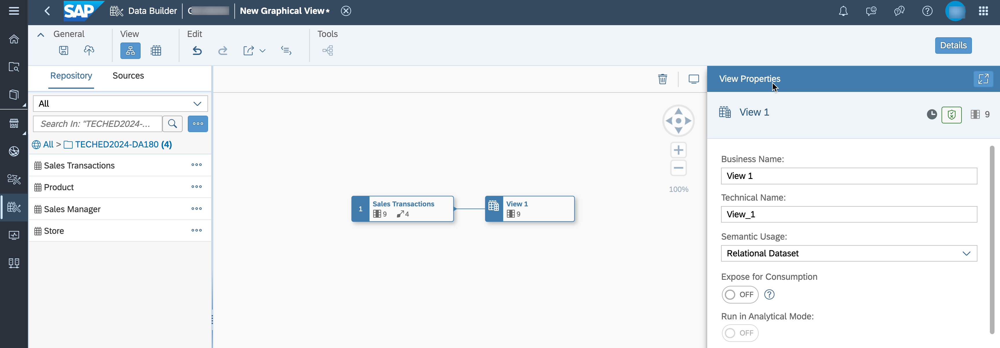
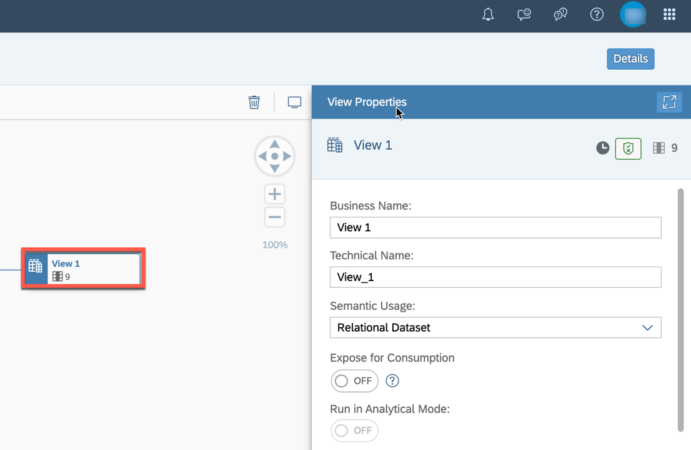
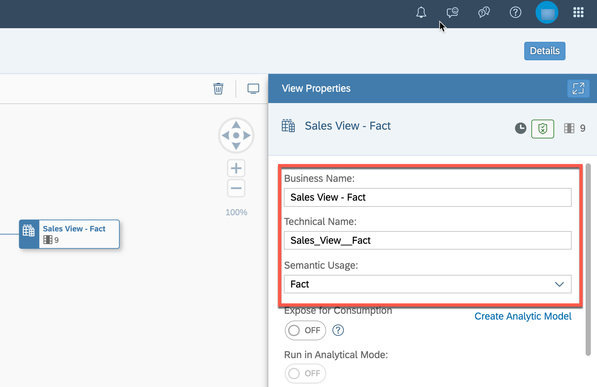
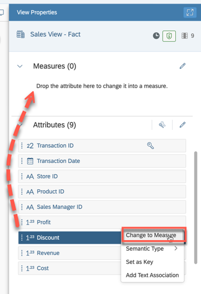
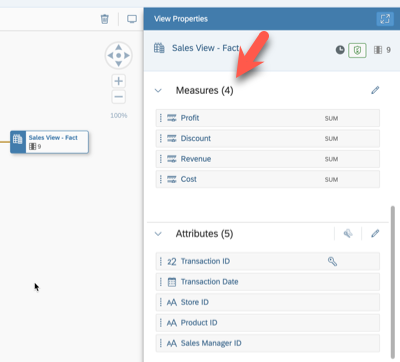
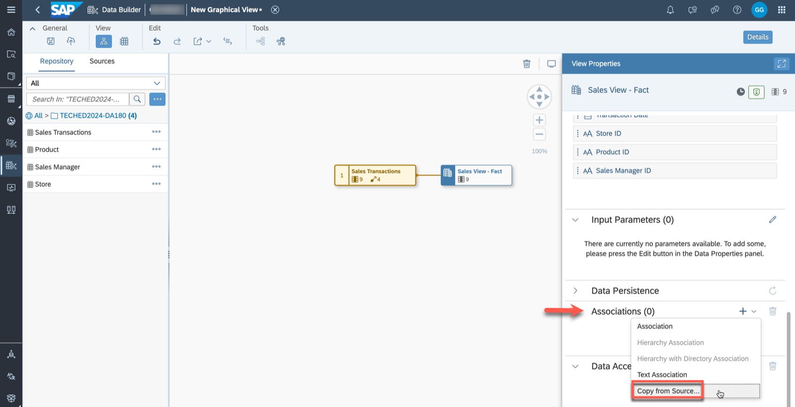
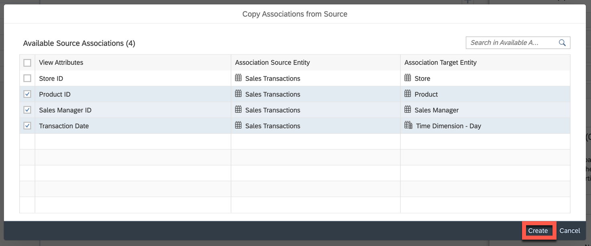
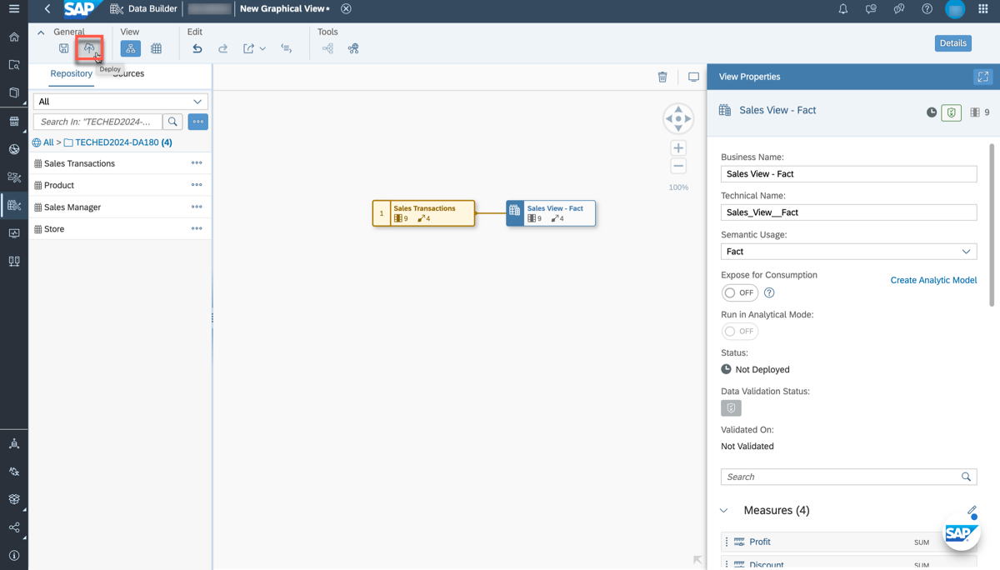
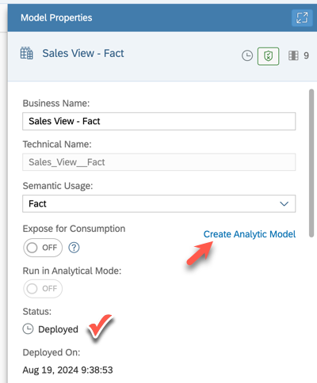
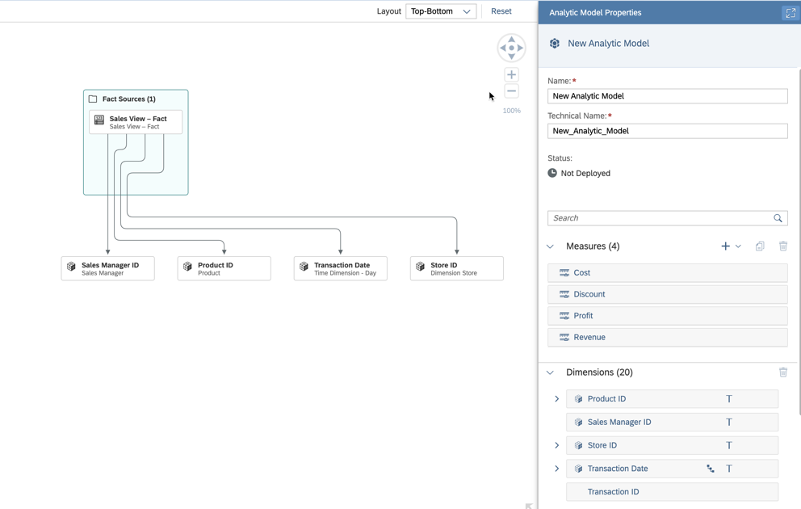

# Exercise 7 - Creating the View & Analytic Model

## :beginner: Detour: SAP Datasphere - Views & Analytic Models

A view in SAP Datasphere provides you with several benefits:
- No-code/low-code using with the graphical editor as well as SQL and SQLscript editor
- Foundation of data modeling on top of remote or local tables or views
- Choose the semantic usage (e.g., Fact or Dimension) - enabling specific functionality and behavior depending which semantic usage is chosen
- Define unions and joins, rename and remove columns, add calculations and filters
   

A view in SAP Datasphere allows you to leverage local tables, remote tables, or views and combine
those into a new view. Transformations defined in a Graphical or SQL View are executed during runtime when a view is accessed, for example via the data preview option or as part of an Analytic Model. By default, views are not persisted but there is the option to run and schedule snapshot replications.

Applying transformations to data is also possible in the entity ***Transformation Flow***. In contrast to views, transformation flows load data from one or more sources and persist the result in a target table. This integration entity can detect delta changes when reading data from a local table which is enabled for delta.

   
An Analytic Model in SAP Datasphere provides the following benefits: <ul><li>Builds the analytical foundation to make data ready for consumption in SAP Analytics Cloud or exposure through the public OData API</li><li>Allows multi-dimensional and rich analytical modelling</li><li>Provides data for analytical purposes to answer different business questions by reusing predefined measures,hierarchies, filters, parameters and associations</li><li>Offers many features like calculated & restricted measures, exception aggregation, non-cumulative measures, pruning, variable support, analytical preview, multi-lingual metadata, etc.</ul>
  

The sources for analytic models are views or tables of the semantic type fact which can contain dimensions, texts, and hierarchies. 

## End of Detour

## Start of the exercise
In this exercise, we will create a view for the sales transaction table which will be the base for the Analytic Model which then can be consumed in SAP Analytics Cloud. The advantage of defining a view as a wrapper for the source table is that the data model is more flexible for further changes. The view containing the semantics is de-coupled from the source object and it would be possible to switch the source of the view from a local table to a remote table from a remote system.

1. Log On to your SAP Datasphere tenant.
2. Select the menu option Data Builder on the left-hand side.
3. Click ***New Graphical View***.
   
  
4. On the left-hand side you can decide between: <ul><li>Repository: Here you have access to the local tables (imported data), views, Intelligent Lookups and Shared Objects.</li><li>Sources: Here you have access to the respectie objects from your connections.</li></ul>

5. Ensure you select the option ***Repository***.
6. Open the folder ***TECHED2024-DA180***. 
7. You are presented with the list of tables, which we created previously.
   
  
8. Drag and Drop the table ***Sales Transactions*** to the canvas.
9. You automatically will – in addition to the table you dragged to the canvas – receive the output view as well,
in our example called ***View 1***.
    
  
10. Ensure the option ***Details*** (top right corner) is enabled. Otherwise, click on the output view that was added, in our example ***View 1***.
11. Navigate to the Properties window.
  

12. Here you can configure properties for the view: <ul><li> Business Name: Sales View – Fact</li><li> Technical Name: Sales_View__Fact</li><li> Semantic Usage: Fact</li>
    
 

  
13. In the panel on the right-hand side, scroll down to the ***Attributes*** section.
14. The columns ***Profit***, ***Discount***, ***Revenue***, and ***Cost*** are measures (quantifiable values that refer to aggregatable fields of a model). Drag and drop these fields to the section ***Measures***. You can also change the type by selecting the ***Change to Measure*** option. 
   
  
15. Verify that your graphical view has four measures.
   

16. Scroll down to the section ***Associations***. Click the ***+*** icon to add a new association. As the source of the view has associations itself, you can copy those instead of creating them again. Select ***Copy from Source***.
  
  
17. Select the available source associations for Product ID, Sales Manager ID and Transaction Date. Click ***Create***. 
    

18. As we created a new dimension view to add a column containing geographic coordinates, create a new association by selecting ***Association*** after clicking on the "+" icon next to the Associations section. 

19. Choose ***Dimension Store*** (View - Dimension) and click on ***Select***.
    

20. Verify that the mapping is done correctly on the column ***Store ID***.
    

21. Save the view in the folder "TECHED2024-DA180". You will be asked to confirm and ***Save*** the Business Name and Technical Name.

22. Deploy your view. 
   

23. Once the view has been successfully deployed, you can create your Analytic Model by selecting the according option on the right-hand side.
 

24. You are now within your Analytic Model as depicted below. You are able to see the sales fact view and its associated dimensions that you added previously. 
 

25. ***Save*** and ***deploy*** your Analytic Model with the business name ***Sales - Analytic Model*** (the technical name is generated). Select the folder "TECHED2024-DA180".

## Summary

You have now created and deployed your first fact based view and Analytic Model. The Analytic Model can now be consumed within SAP Analytics Cloud to answer different business questions.

Continue with - [Exercise 8 - Top 10 Revenue Generating Products ](../ex08/README.md)
