# Exercise 8 - Top 10 Revenue Generating Products

In this exercise, we will create a story in SAP Analytics Cloud, which allows us to analyse sales and identify the top 10 revenue generating products.

1. Log On to your SAP Analytics Cloud tenant.
  
 

---

>:bulb: **Tip:** The system will ask you to resign in. Use the same user name and password for SAC as for Datasphere.

---

2. Select the menu ***Stories*** in the left-hand panel.

3. Select the option ***Canvas*** to create a new story.
  

4. Select ***Optimized Design Experience*** when asked which design mode to use. Click ***Create***.
  

5. Under Widgets, select and drag ***Chart*** onto the canvas.
 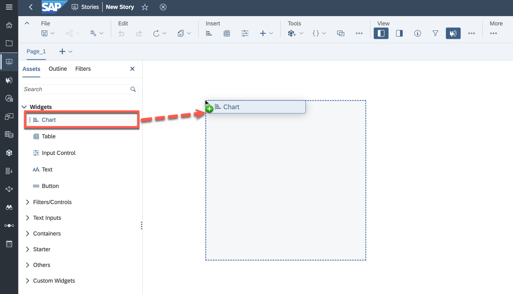
6. To select the model that you want to reference in your story <ul><li>select ***DATASPHERE*** as the connection on the left panel</li><li>select your SPACE e.g. ***GE12345*** and the folder</li><li>for our first example, select your ***Sales - Analytic Model***</li></ul>
 

7. Now select the newly created empty chart on the canvas.

8. Navigate to the Builder Panel on the right-hand side.
  

9. Click ***Add Dimension*** as part of the Dimensions section.
 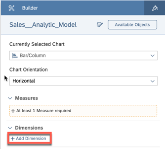 

10. Select ***Transaction Date*** & ***Product ID***.
 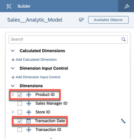
>:bulb: Ensure the Transaction Date is positioned first within the Dimensions section overview.  

11. Add a measure by clicking on the ***At least 1 Measure required*** section.

12. Select the measure ***Revenue***.
 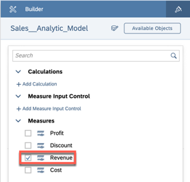

13. Click on the Filter icon for the dimension ***Transaction Date***. 
 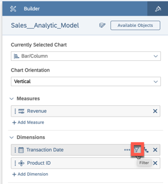 

14. Select the option ***Filter by Member***.
  

15. Open the list of members and select the year 2022. Click OK.
 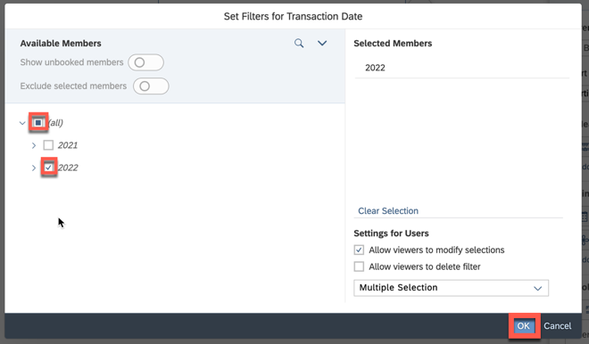

16. Open the ***More Actions*** menu (***...***) for the chart (top right corner of chart).

17. Within the menu, go to ***Rank*** > ***Top N Options*** > Update value to "10". Click ***Apply***.
 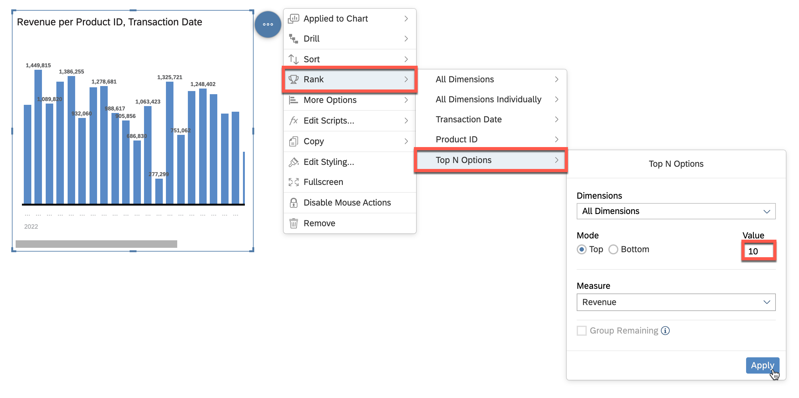

18. Update Chart Orientation to ***Horizontal*** in the Builder Panel.
 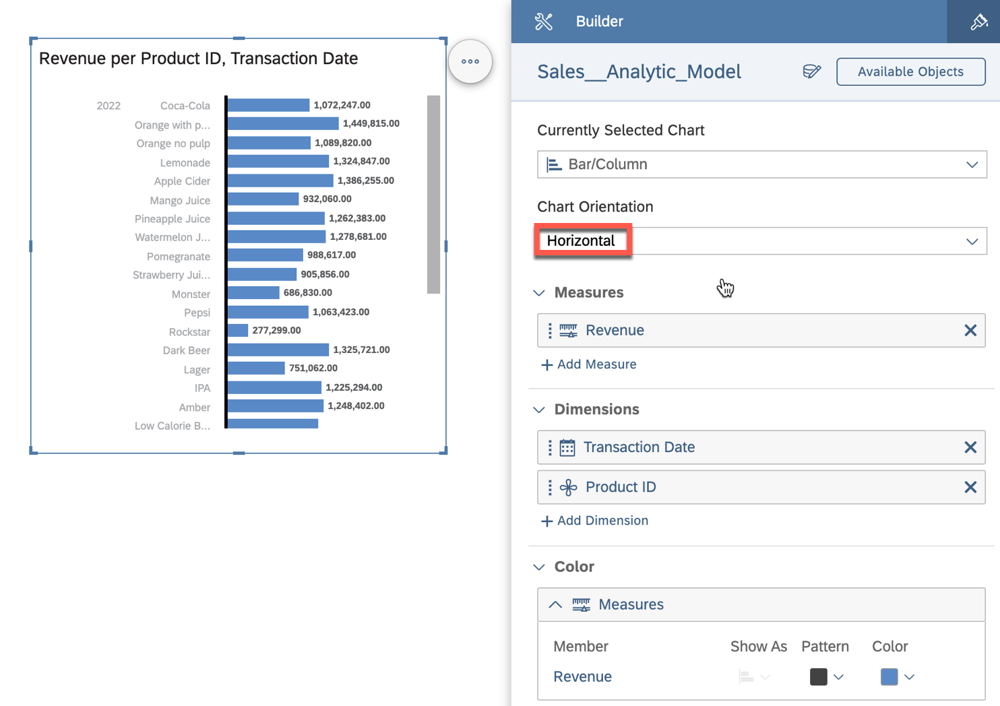

19. You can adjust the sizing of the chart by clicking and dragging the brackets outward or inward and also move the y-Axis so that the full product name is displayed.
 

20. Your chart should look like this. Note that only the description of the product is displayed based on the configuration in ***Display Options*** for ***Product ID***.
 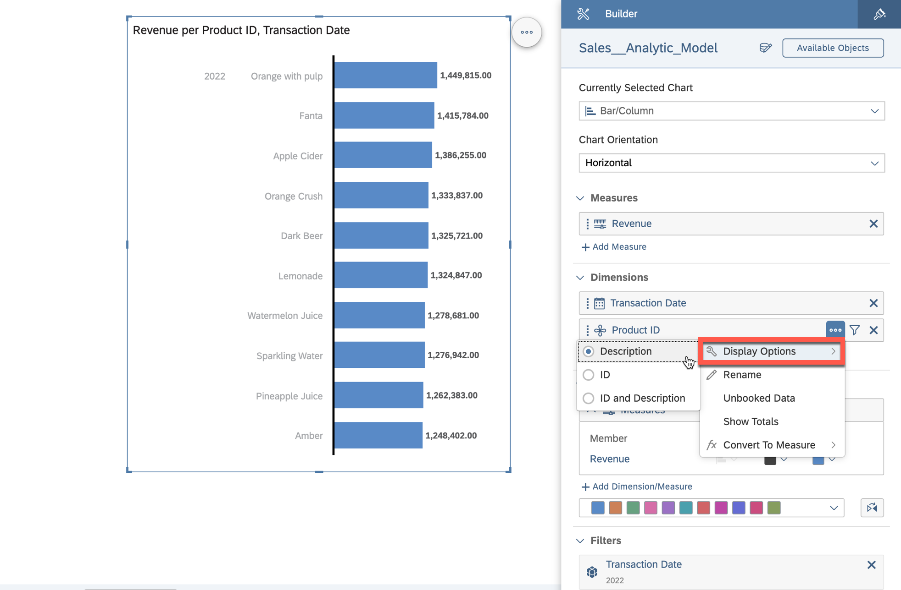 

21. We want to visualize the change of revenue along time in an additional chart. Drag a new chart into the new canvas.
 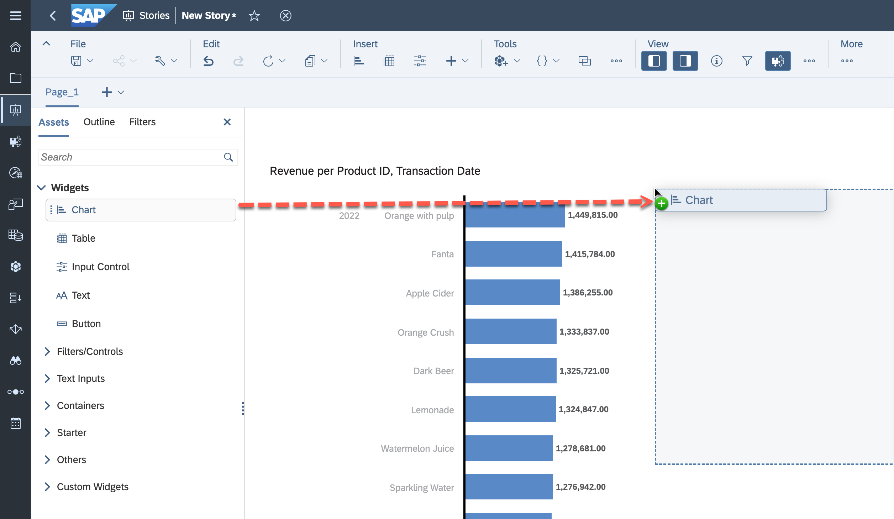 

22. Set the following settings:  <ul><li>Select ***Line*** as Chart Type.</li><li>The measure for ***Left Y-Axis*** is ***Revenue***.</li><li>Select ***Transaction Date*** as ***Dimension***</li><li>Filter ***Product Category ID*** (Member) to ***Juices***</li></ul>
 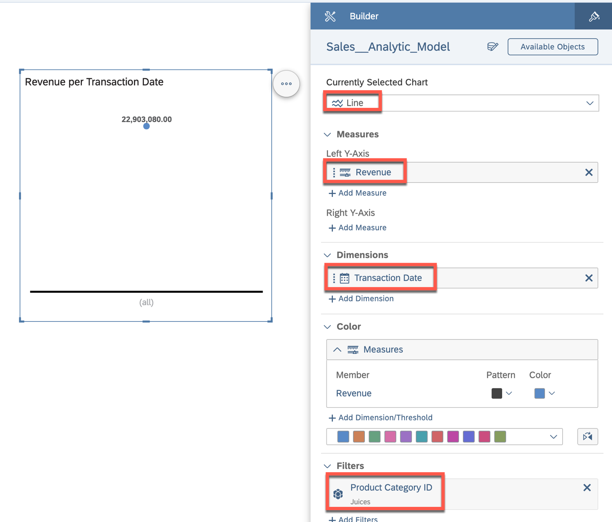 

23. Use the time hierarchy defined for ***Transaction Date*** to have a quarter based analysis. Set the hierarchy to ***Year, Quarter, Month, Day*** by clicking on ***Change Hierarchy***. Adjust the level to ***Level 3*** so that the revenue is displayed per quarter.
 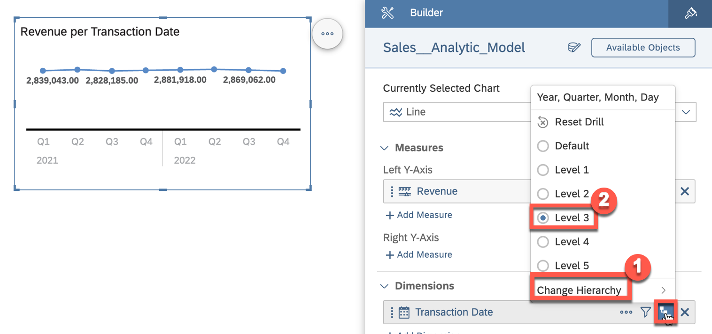 

24. You can modify the style of your story and for example add elements, headings or adjust headings.
 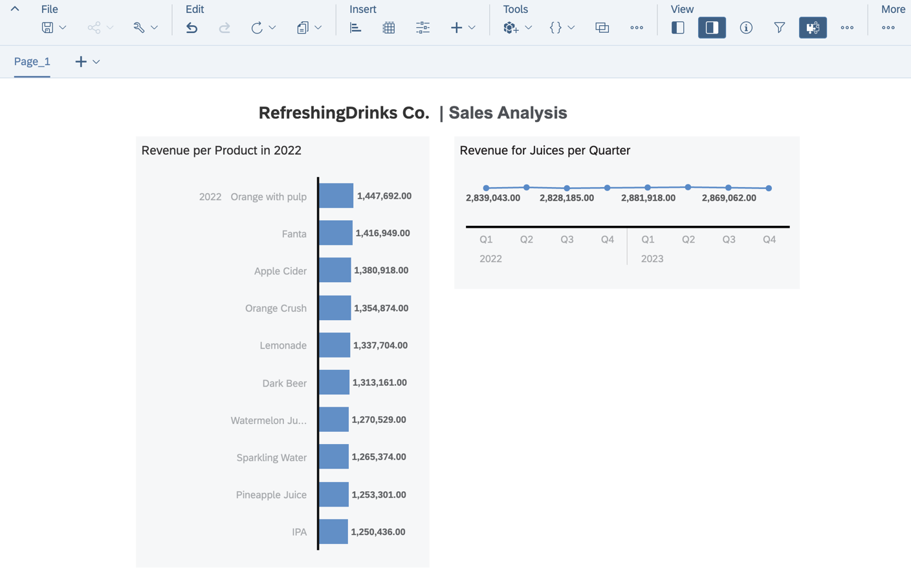 

25. In the ***File*** menu select the option ***save*** to save your story.

26. Create a folder that matches your space name,  e.g. ***GE12345***.
  

27. Enter a name and a description like ***Revenue Analysis - Products***.

28. Click OK.

## Summary

You've now created your first SAP Analytics Cloud Story on top of the data model you created earlier. 

Continue to - [Exercise 09: Revenue by Geography ](../ex09/README.md)
