# Exercise 9 - Geographic Revenue Distribution

In this exercise, we will set up a story in SAP Analytics Cloud, which allows us to view the measures along a
geographic map.

1. Log On to your SAP Analytics Cloud tenant.
  
 

---

>:bulb: **Note:** The system may ask you to sign in again. Use the same user name and password for SAC as for Datasphere.

---

2. Select the menu ***Stories*** in the left-hand panel.

3. Select the option ***Canvas*** to create a new story.
  

4. Select ***Optimized Design Experience*** when asked which design mode to use. Click ***Create***.
  

5. Under ***Others***, select and drag the ***Geo Map*** onto the canvas.
 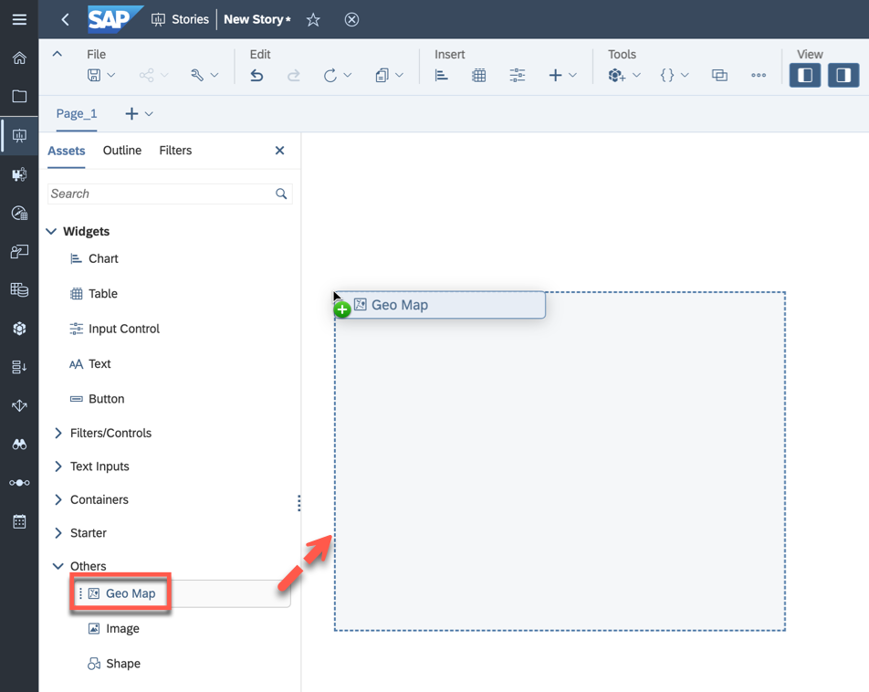
  
6. Resize the map so that it uses the complete canvas. You can accomplish this by opening the ***More*** menu (***...***) and selecting ***Fullscreen***.
 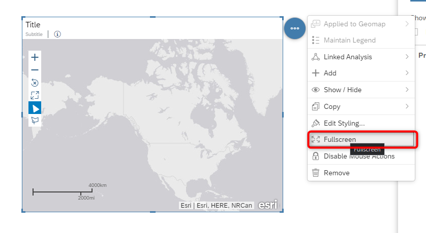

7. In the Builder panel on the right-hand side, select the option ***Add Layer*** for the Content Layer option.
 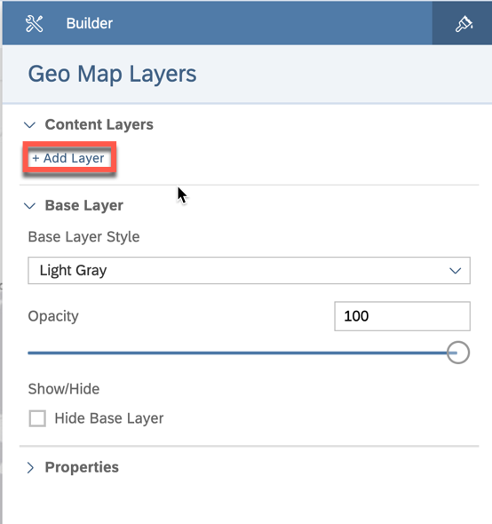 

8. Click on the model icon to choose your data model.
 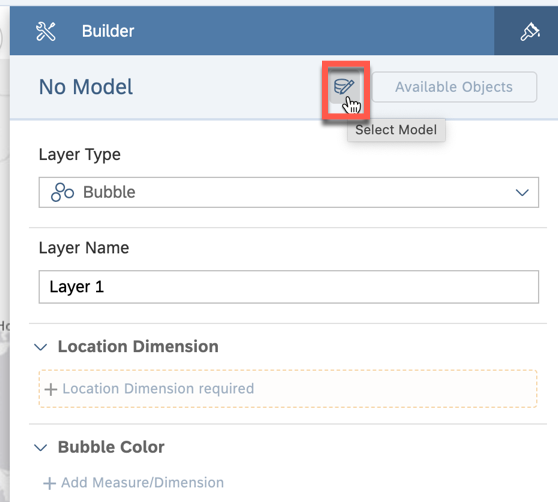

9. Click within the search field and choose ***Select other model*** option
 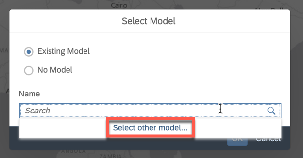

10. To select the model that you want to reference in your story <ul><li>select ***DATASPHERE*** as the connection on the left panel</li><li>select your SPACE e.g. ***GE12345***</li><li>for our first example, select your ***Sales - Analytic Model***</li></ul>
 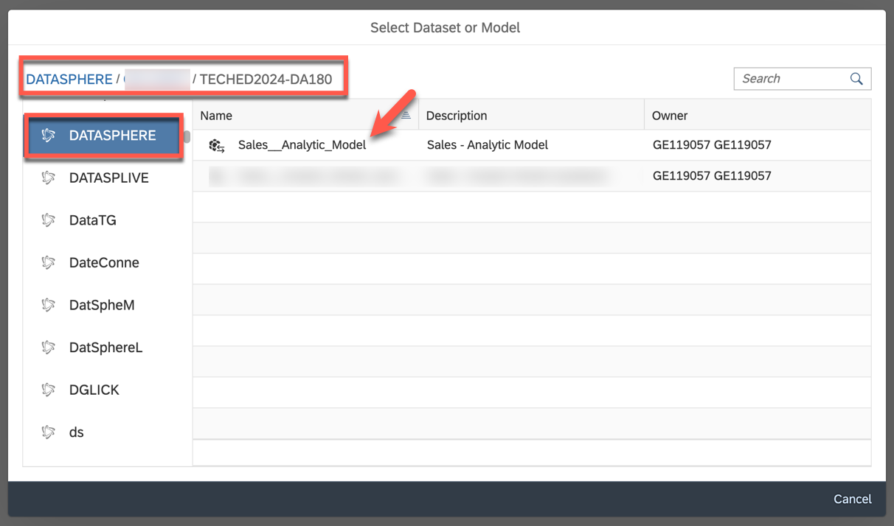

11. In the Builder panel, click on ***Location Dimension Required*** for the ***Location Dimension*** area.

12. Select the option ***Store Location***. This is the store location dimension we created previously based on the
longitude and latitude values for the store dimension.
 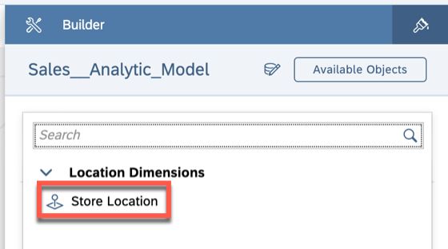 

13. Click on ***Add Measure*** for the Bubble Size.

14. Select measure ***Revenue***.
 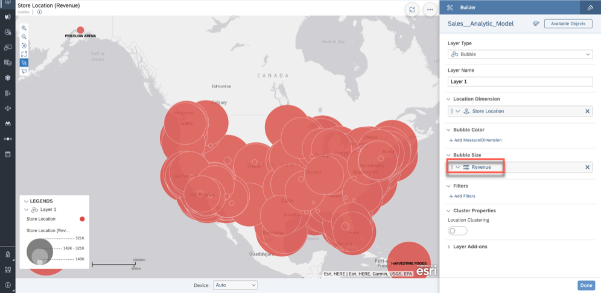 

15. Click ***Add Measure / Dimension*** for the Bubble Color
16. Select measure ***Profit***.

17. Now open the details for the measure ***Profit*** as part of the Bubble Color
18. Open the list of Color Palette.
 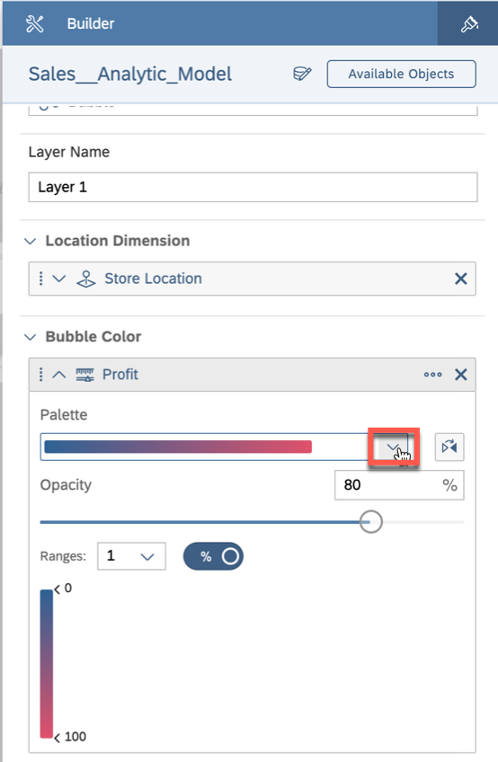 

19. Select the second entry from the ***continuous*** category (red to green).
 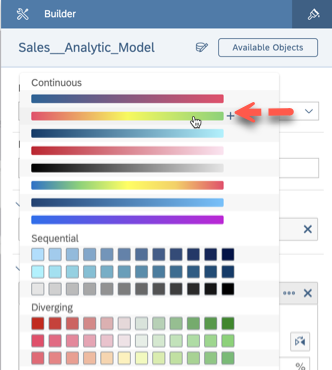 

20. Now open the details for the Bubble Size definition (Revenue).
21. Set the size to 35%.
 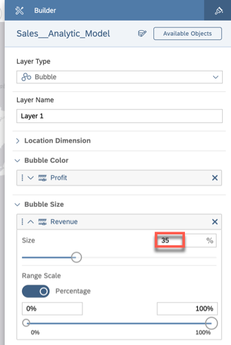 

22. Click ***Done*** to save your Layer.

23. Your map should look like this.
  

24. In the File menu, select ***Save*** to save your story.
25. Select the folder that matches your assigned user number.
26. Enter a name and description like ***Geographic Revenue Distribution***.
27. Click OK.
 

## Summary

You've now created your second story in SAP Analytics Cloud based on the preconfigured DATASPHERE connection to your data models in SAP Datasphere. 

You can continue with one of the optional exercises:
- [Exercise 20: Identify Top-Performing Sales Managers with Just Ask](../ex20/README.md)
- [Exercise 21: Create Row-Level Permissions based on External Hierarchy)](../ex21/README.md)
- [Exercise 22: Explore the Analytic Model](../ex22/README.md)
- [Exercise 23: Create a Transformation Flow)](../ex23/README.md)
