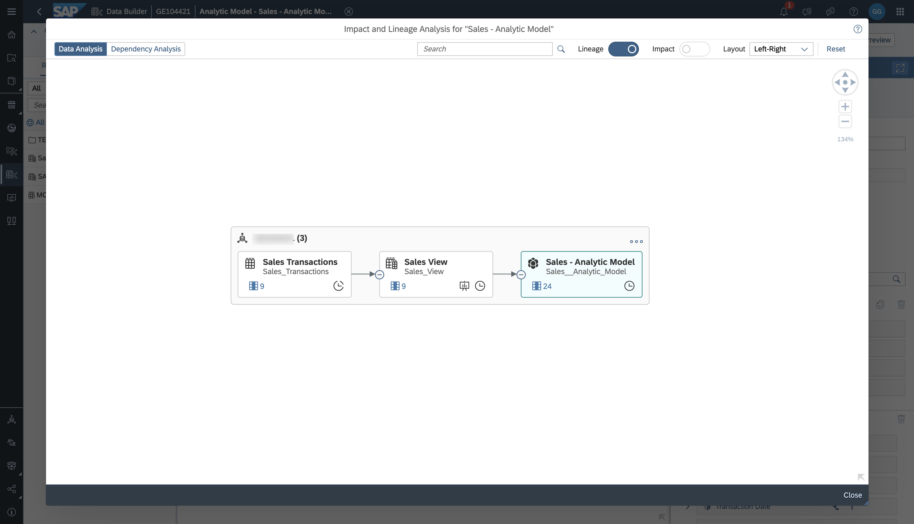
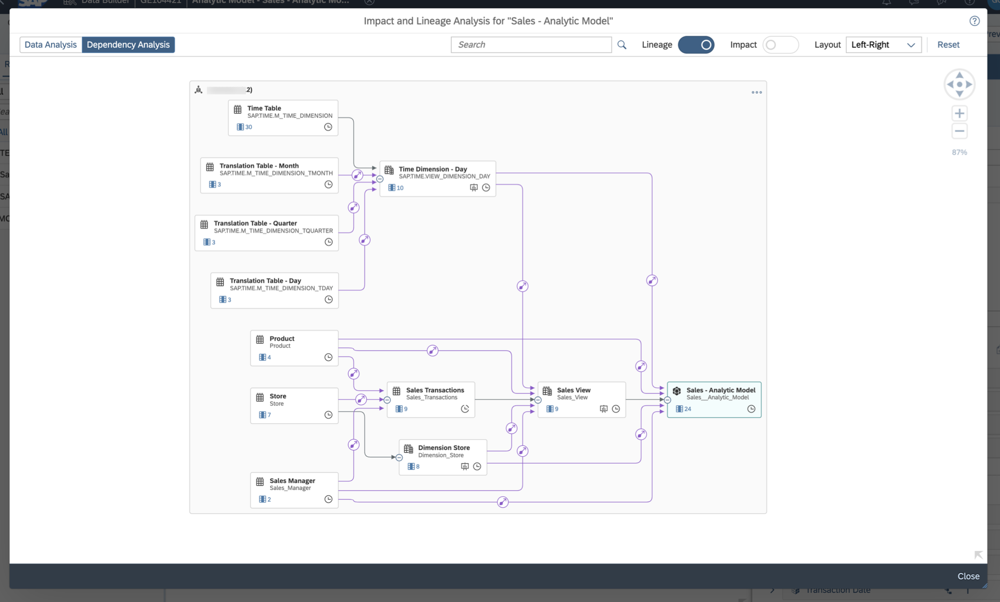
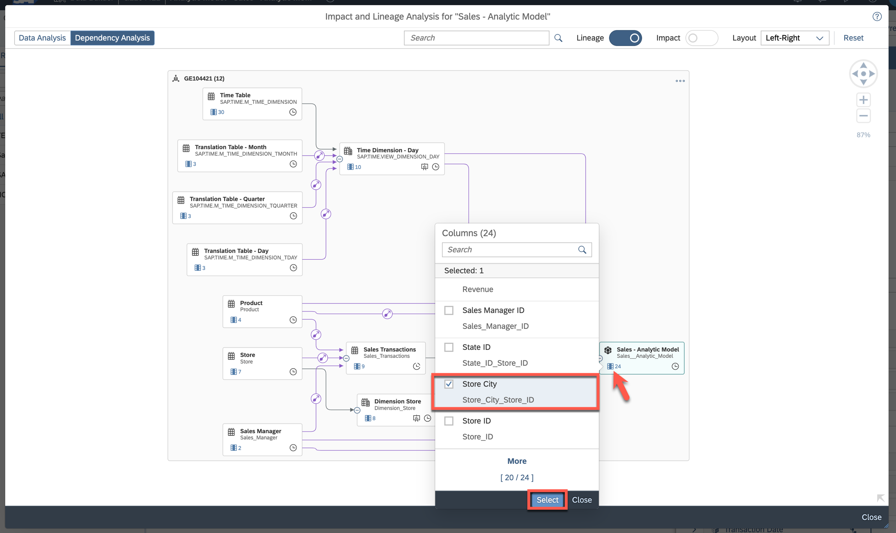
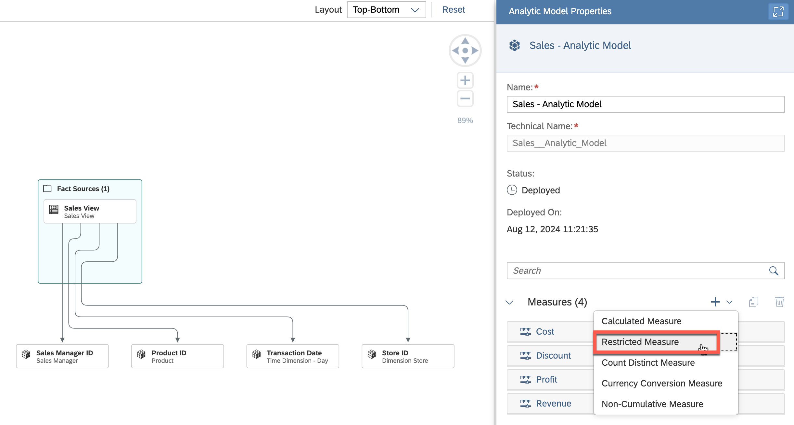
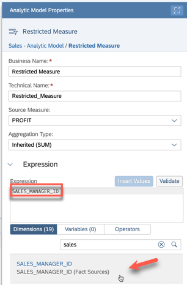
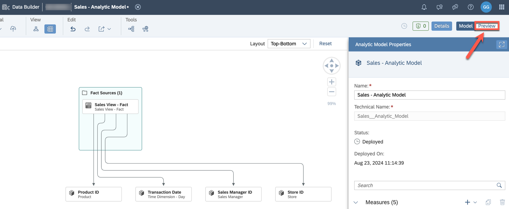

# Exercise 22 - Explore the Analytic Model

>:memo: **Note:** This is an OPTIONAL exercise.

---

## :beginner: Detour: SAP Datasphere - Analytic Model

Analytic models form the analytical foundation for preparing data for consumption in SAP Analytics Cloud. They enable the creation and definition of multi-dimensional models, providing data for analytical purposes to answer various business questions. Predefined measures, hierarchies, filters, parameters, and associations offer flexible and straightforward navigation through the underlying data.

In this exercise, you will learn how to use the data preview of the Analytic Model and create different types of new measures to enhance the existing model.

## End of Detour

## Start of the exercise

1. Log On to your SAP Datasphere tenant.

2. Select the menu option Data Builder on the left-hand side.

3. Open the previously created Analytic Model ***Sales - Analytic Model***.

4. To get an overview of the data model as a reminder, open the ***Impact and Lineage Analysis***.

      

5. The ***Data Analysis*** diagram helps you understand the lineage of the Analytic Model.  

    This view focuses on data movements and transformations, showing the flow from the local table containing sales transactions to the view and the Analytic Model.  

      

6. Switch to the ***Dependency Analysis*** diagram to display objects connected through associations (and data access controls, if defined). Here, you can view the lineage of the associations, such as the time dimension.

     

7. In addition to the lineage and impact of objects, you can analyze columns of tables, graphical and SQL views and Analytic Models. Click the columns icon on the Analytic Model to open the list of columns, select ***Store City*** and click ***Select***.

     

8. The diagram refreshes to show the lineage of the selected column under the analyzed object.

     

9. Select ***Close*** to return to the Analytic Model editor. 

10. Create a new ***Restricted Measure***. Restricted measures are based on existing measures but apply flexible filter expressions. They can use static filters (as done in this exercise) or refer to dimension attributes or variables.

     

11. We define a restricted measure to analyze the profit generated by the sales managers, specifically focusing on `Janet Bury`.

     

12. In the ***Expression*** editor, add ***=*** after `SALES_MANAGER_ID`. Click ***Insert Values*** and select `Janet Bury` (ID `SM1`).

     

13. Change the Business Name and the Technical Name to ***Profit-JanetBury***.

14. Open the ***Preview*** in the upper-right corner. This is an analytical preview that allows you to navigate through various dimensions and view the aggregated data. It provides a glimpse of how the data will appear in an SAP Analytics Cloud story.  

     

15. Open the Builder on the right side and select the measures ***Profit*** and ***Profit-JanetBury***, as well as ***Product Category ID*** in the ***Dimensions*** section. The two measures allow you to compare the profit generated by Janet with the overall profit.  

     

16. Return to the Analytic Model editor by selecting ***Model*** in the upper right corner.

17. Save and deploy the model.

## Summary

You have now explored more of the various features of the Analytic Model.  

You can continue with one of the _optional_ exercises:
- [Exercise 20: Identify Top-Performing Sales Managers with Just Ask](../ex20/README.md)
- [Exercise 21: Create Row-Level Permissions based on External Hierarchy](../ex21/README.md)
- [Exercise 23: Create a Transformation Flow](../ex23/README.md)
